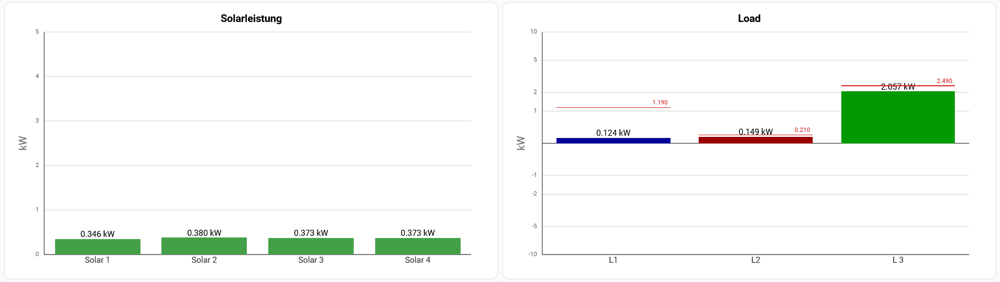

# Custom Barchart Card for Home Assistant

A flexible and customizable bar chart card for Home Assistant dashboards, supporting linear and logarithmic scales, symmetric axes, clickable bars, and dynamic markers.

---

## ✨ Features

- Vertical bar chart with:
  - Multiple bars with individual entities or entity groups
  - Linear and symmetric logarithmic scaling
  - Optional min/max clamping
  - Axis grid and unit display
  - Max-value marker line per bar
  - Clickable bars for `more-info`, navigation, or custom URLs

---

## ⚙️ Installation

### Manual

1. Download `custom-barchart-card.js` to your `www` folder (e.g. `/config/www/`)
2. Add this to your `ui-lovelace.yaml` or dashboard resource:
   ```yaml
   resources:
     - url: /local/custom-barchart-card.js
       type: module
   ```

### HACS (planned)

*Coming soon. Will be available in the HACS frontend as a custom repository.*

---

## ✏️ Configuration

### Example (Minimal)

```yaml
type: custom-barchart-card
title: Power Overview
grid:
  min: -5
  max: 5
  unit: kW
bars:
  - name: Solar
    entity: sensor.solar_power
    color: orange
  - name: Load
    entity: sensor.load_power
    color: red
    tap_action:
      action: more-info
```

### Example with symmetric logarithmic scale

```yaml
type: custom-barchart-card
title: Grid Flow
logarithmic: true
grid:
  max: 10
  unit: kW
bars:
  - name: Grid
    entity: sensor.grid_flow
    color: green
```

---

## 🔢 Parameters

### General

| Name          | Type    | Default | Description                           |
| ------------- | ------- | ------- | ------------------------------------- |
| `title`       | string  | ""      | Optional title shown at the top       |
| `logarithmic` | boolean | false   | Enables symmetric logarithmic scaling |
| `symmetric`   | boolean | false   | Use midpoint axis (0) for display     |
| `bars`        | array   |         | List of bar definitions (see below)   |
| `grid`        | object  |         | Axis settings (see below)             |
| `max_marker`  | object  |         | Global style for max marker per bar   |

### Grid

| Name         | Type   | Default | Description                                 |
| ------------ | ------ | ------- | ------------------------------------------- |
| `min`        | number | 0       | Minimum value of axis (ignored in log mode) |
| `max`        | number | 100     | Maximum value of axis                       |
| `lines`      | number | 5       | Number of horizontal lines                  |
| `unit`       | string |         | Unit label shown on Y-axis                  |
| `color`      | string | `#999`  | Grid line color                             |
| `width`      | number | 1       | Grid line width                             |
| `dash`       | string | `3,2`   | Grid dash style                             |
| `axis_color` | string | `#000`  | Axis (X/Y) color                            |
| `axis_width` | number | 1.5     | Axis line width                             |
| `font_size`  | number | 10      | Tick label font size                        |

### Bar definition (inside `bars` array)

| Name         | Type     | Default | Description                    |
| ------------ | -------- | ------- | ------------------------------ |
| `name`       | string   |         | Label shown under the bar      |
| `entity`     | string   |         | Entity to read value from      |
| `entities`   | string[] |         | Sum of multiple entities       |
| `color`      | string   | `#999`  | Bar fill color                 |
| `font_size`  | number   | 12      | Font size for value and name   |
| `decimals`   | number   | 3       | Decimal places for value label |
| `max_entity` | string   |         | Optional max-line entity       |
| `tap_action` | object   |         | Click behavior (see below)     |

### `tap_action` (per bar)

| Action      | Description                     |
| ----------- | ------------------------------- |
| `more-info` | Opens entity detail popup       |
| `navigate`  | Navigates to a Lovelace path    |
| `url`       | Opens a custom URL in a new tab |
| `none`      | Disables click action           |

```yaml
  tap_action:
    action: navigate
    navigation_path: /lovelace/energy
```

---

## 🔹 Future Ideas

- Tooltip on hover
- Optional bar outlines
- Dynamic color thresholds
- Horizontal layout

---

## 🚀 License & Credits

This card was developed by HeWeDe inspired by the `custom-gauge-card`.
MIT License. Contributions welcome!

---

## 📍 GitHub Repository

Coming soon... (link folgt nach Upload)
